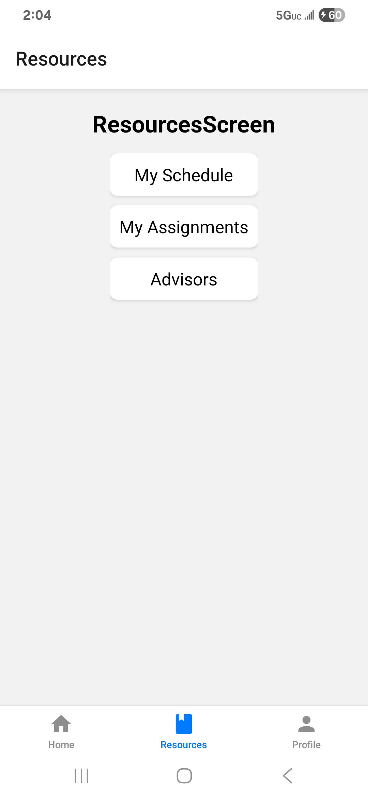

# The App

A student hub with three tabs (home, resources, and profile).

## How to run

1. Have the Expo Go app downloaded on your phone.
2. Open the terminal in VS Code and enter `npx expo start` or `npx expo start --tunnel`.
3. Open the Expo Go app on your phone and scan the QR code from the terminal.

It should now be running on your phone.

